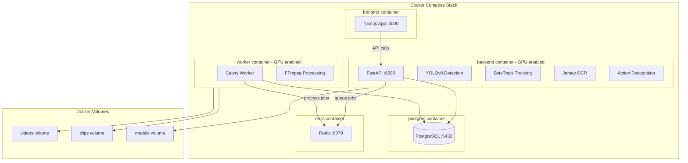

# Basketball Video Analysis Application

## Architecture Overview (Dockerized with Local GPU)




## Docker Setup (RTX 4080 Optimized)

Your RTX 4080 (16GB VRAM) is excellent for this workload. Expected performance:

- **YOLOv8x inference**: ~60-80 FPS on 1080p video
- **Full pipeline**: ~15-30 FPS (detection + tracking + OCR)
- **Processing time**: Near real-time to 2x real-time for full analysis

### Docker Compose Services


| Service  | Image Base               | GPU | Port | Purpose                |
| -------- | ------------------------ | --- | ---- | ---------------------- |
| frontend | node:20-alpine           | No  | 3000 | Next.js web UI         |
| backend  | nvidia/cuda:12.1-runtime | Yes | 8000 | FastAPI + AI models    |
| worker   | nvidia/cuda:12.1-runtime | Yes | -    | Celery background jobs |
| postgres | postgres:16-alpine       | No  | 5432 | Database               |
| redis    | redis:7-alpine           | No  | 6379 | Job queue + cache      |


### GPU Container Requirements

```yaml
# docker-compose.yml GPU configuration
services:
  backend:
    deploy:
      resources:
        reservations:
          devices:
            - driver: nvidia
              count: 1
              capabilities: [gpu]
```

**Prerequisites on Windows:**

- Docker Desktop with WSL2 backend
- NVIDIA Container Toolkit installed
- Latest NVIDIA drivers (Game Ready or Studio)

## Supported Video Sources

### File Uploads

- **Formats**: MP4, MOV, AVI, MKV, WEBM, WMV (any FFmpeg-compatible format)
- **Resolution**: 480p to 4K (higher = better jersey detection)
- **Frame rate**: 24-60fps

### YouTube URLs

- Paste any YouTube video URL
- Automatically downloaded via `yt-dlp` at best available quality
- Supports public videos, unlisted videos (with URL), and playlists (first video)

### Optimized for Amateur Footage

The pipeline is tuned for gym/amateur recordings:

- Lower confidence thresholds for detection in variable lighting
- Aggressive temporal smoothing for jersey OCR (handles motion blur)
- Multi-scale detection for players at varying distances from camera
- Handles shaky camera and non-standard angles

## Technology Stack

### Backend (Python)

- **FastAPI** - High-performance async API framework
- **Ultralytics YOLOv8** - Player and ball detection (60+ FPS, highly accurate)
- **ByteTrack** - Multi-object tracking with identity persistence
- **PaddleOCR or EasyOCR** - Jersey number recognition
- **PyTorch** - Action recognition models (R(2+1)D or SlowFast)
- **FFmpeg-python** - Video clipping and processing
- **yt-dlp** - YouTube video downloading
- **Celery + Redis** - Background task processing for long videos

### Frontend (TypeScript)

- **Next.js 14** - React framework with App Router
- **Tailwind CSS** - Styling
- **Video.js** - Video player with custom timeline markers
- **Recharts** - Statistics visualization

### Storage

- **PostgreSQL** - Player data, timestamps, statistics
- **MinIO/S3** - Video file storage
- **Redis** - Job queue and caching

## AI Processing Pipeline

### 1. Player Detection and Tracking

```
Video Frames → YOLOv8 (detect players/ball) → ByteTrack (assign IDs) → Jersey OCR → Player Identity
```

- YOLOv8 detects all players and the ball in each frame
- ByteTrack maintains consistent player IDs across frames even through occlusions
- Jersey number OCR runs on detected player crops to identify specific players
- Temporal smoothing improves jersey number accuracy (73.8% → 90%+ with multi-frame voting)

### 2. Action Recognition

The system will detect and count these basketball actions:


| Action           | Detection Method                                |
| ---------------- | ----------------------------------------------- |
| Shots (2pt/3pt)  | Ball trajectory + player pose + court position  |
| Made/Missed      | Ball-hoop intersection detection                |
| Rebounds         | Ball possession change after missed shot        |
| Assists          | Pass → shot sequence detection                  |
| Steals/Turnovers | Possession change patterns                      |
| Blocks           | Defensive player + shot trajectory interruption |


### 3. Timestamp and Clip Generation

- Store frame ranges where each player is actively involved
- Merge nearby segments (within 2-3 seconds) into continuous clips
- Use FFmpeg for fast, lossless clip extraction

## Key Files to Create

### Backend Structure

```
backend/
├── app/
│   ├── main.py                 # FastAPI app entry
│   ├── api/
│   │   ├── videos.py           # Upload, process endpoints
│   │   ├── players.py          # Player query endpoints
│   │   └── clips.py            # Clip generation endpoints
│   ├── services/
│   │   ├── detector.py         # YOLOv8 + ByteTrack pipeline
│   │   ├── jersey_ocr.py       # Jersey number recognition
│   │   ├── action_recognizer.py # Basketball action detection
│   │   ├── clip_generator.py   # FFmpeg clip extraction
│   │   └── cloud/              # Cloud provider adapters
│   │       ├── replicate.py
│   │       └── roboflow.py
│   ├── models/
│   │   └── schemas.py          # Pydantic models
│   └── workers/
│       └── tasks.py            # Celery background tasks
├── requirements.txt
└── Dockerfile
```

### Project Root Structure

```
SportHighlightsApp/
├── docker-compose.yml          # Main orchestration file
├── docker-compose.override.yml # Local dev overrides
├── .env.example                # Environment template
├── backend/
│   ├── Dockerfile              # GPU-enabled Python image
│   └── ...
├── frontend/
│   ├── Dockerfile              # Node.js image
│   └── ...
├── nginx/
│   └── nginx.conf              # Reverse proxy config
└── scripts/
    ├── setup-gpu.ps1           # Windows GPU setup helper
    └── download-models.py      # Pre-download AI models
```

### Frontend Structure

```
frontend/
├── app/
│   ├── page.tsx                # Home/upload page
│   ├── analyze/[id]/page.tsx   # Analysis view
│   └── api/                    # API routes (proxy)
├── components/
│   ├── VideoUploader.tsx
│   ├── VideoPlayer.tsx         # Custom player with timeline
│   ├── PlayerSelector.tsx
│   ├── TimelineMarkers.tsx     # Visual markers for player involvement
│   └── StatsPanel.tsx
└── package.json
```

## Processing Approach: Local GPU First, Cloud Fallback

### Primary: Local GPU (RTX 4080)

- **Pros**: No API costs, full control, faster iteration, privacy
- **Cons**: Limited to your machine's availability
- All AI processing runs in Docker containers with NVIDIA GPU passthrough
- Models downloaded once and cached in Docker volume

### Fallback: Cloud AI Services (if needed)

If local performance is insufficient or you need to scale:


| Service                | Use Case                 | Cost Estimate                    |
| ---------------------- | ------------------------ | -------------------------------- |
| **Replicate**          | Run YOLOv8/custom models | ~$0.0023/sec GPU time            |
| **Roboflow Inference** | Hosted object detection  | Free tier: 1000 inferences/month |
| **RunPod**             | Full GPU instances       | ~$0.40/hr for RTX 4090           |
| **Google Video AI**    | Basic person detection   | ~$0.10/min of video              |


### Switching Between Local and Cloud

The architecture supports both via environment variables:

```env
# .env configuration
PROCESSING_MODE=local  # or "cloud"
CLOUD_PROVIDER=replicate  # replicate, roboflow, runpod

# Cloud credentials (only needed if PROCESSING_MODE=cloud)
REPLICATE_API_TOKEN=your_token
ROBOFLOW_API_KEY=your_key
```

## Database Schema

```sql
-- Core tables
videos (id, filename, duration, status, created_at)
players (id, video_id, jersey_number, team, confidence)
player_segments (id, player_id, start_frame, end_frame, start_time, end_time)
actions (id, video_id, player_id, action_type, frame, timestamp, confidence)
clips (id, video_id, player_id, start_time, end_time, file_path)
```

## User Flow

1. **Upload** - User uploads basketball video (MP4, MOV, etc.)
2. **Process** - Backend queues video for AI analysis (shows progress)
3. **Review** - User sees detected players with jersey numbers
4. **Select Player** - User picks a player to focus on
5. **Timeline** - Interactive timeline shows all moments player is involved
6. **Statistics** - Dashboard shows player's detected actions (shots, rebounds, etc.)
7. **Export** - Generate clips of player's key moments

## Pre-trained Models to Use

- **YOLOv8x** - Best accuracy for player/ball detection ([Ultralytics](https://docs.ultralytics.com/))
- **ByteTrack** - State-of-the-art multi-object tracking
- **SportsNet or Basketball-51 trained model** - For action recognition
- **PaddleOCR** - Jersey number reading (fine-tune on sports dataset if needed)

## Limitations and Considerations

- **Jersey visibility** - Numbers may be occluded; system uses temporal voting across frames
- **Camera angle** - Broadcast footage works best; single-angle amateur video is harder
- **Processing time** - With RTX 4080, expect near real-time to 2x real-time for full analysis
- **Action accuracy** - Complex actions like assists require context; expect 80-90% accuracy initially

## Quick Start Commands

```powershell
# 1. Clone and setup
cd c:\Dev\AI\SportHighlightsApp

# 2. Copy environment file
cp .env.example .env

# 3. Start all services (first run downloads models ~2-3GB)
docker compose up -d

# 4. View logs
docker compose logs -f backend

# 5. Access the app
# Frontend: http://localhost:3000
# API docs: http://localhost:8000/docs
```

## Development Workflow

```powershell
# Start with hot-reload for development
docker compose -f docker-compose.yml -f docker-compose.override.yml up

# Rebuild after dependency changes
docker compose build backend

# Run tests
docker compose exec backend pytest

# Check GPU is accessible in container
docker compose exec backend nvidia-smi
```

